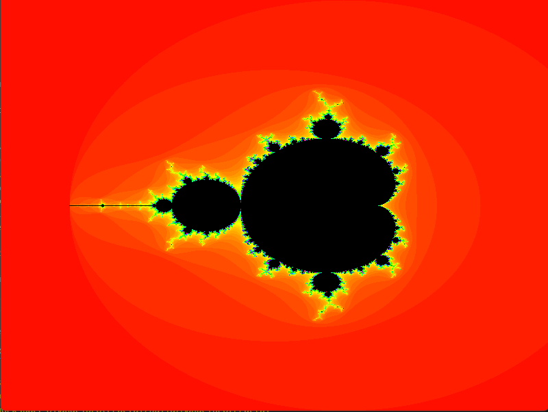
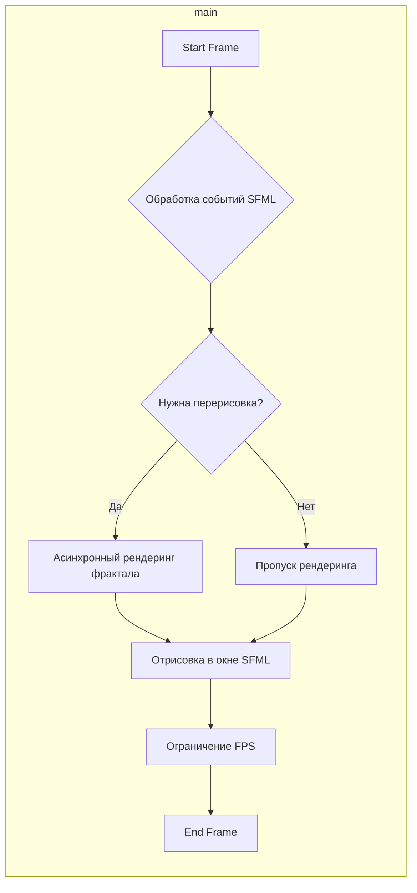

# Визуализация "Фрактала Мандельброта" на C++23 с использованием stdexec и SFML

Интерактивное приложение для вычисления, построения и исследования фрактала Мандельброта, разработанное на C++23 с использованием современного подхода к асинхронному программированию (NVIDIA `stdexec`) и графической библиотеки SFML.

Приложение позволяет визуализировать знаменитый фрактал Мандельброта — множество точек на комплексной плоскости, обладающее свойством самоподобия. Пользователь может интерактивно исследовать фрактал, приближая и отдаляя его участки с помощью мыши.

Основная цель проекта — продемонстрировать применение модели Sender/Receiver для построения гибкого и производительного асинхронного конвейера операций: от обработки пользовательского ввода до параллельного вычисления и финальной отрисовки кадра.



## Навигация
- [Архитектура](#архитектура)
- [Используемые технологии](#используемые-технологии)
- [Начало работы](#начало-работы)
- [Сборка проекта](#сборка-проекта)
- [Настройка и подключение внешнего дисплея (Windows/Linux)](#настройка-и-подключение-внешнего-дисплея-windowslinux)
- [Кейсы использования](#кейсы-использования)
- [Тестирование](#тестирование)

---

## Архитектура

Архитектура приложения построена вокруг асинхронного пайплайна, который итеративно выполняется в главном цикле. Каждая операция в пайплайне представлена в виде **сендера** (`sender`), который по завершении передает результат следующему звену — **ресиверу** (`receiver`). Это позволяет декларативно описывать сложную логику, разделяя ее на независимые компоненты.

Вычисления производятся параллельно с использованием пула потоков `exec::static_thread_pool` для максимальной производительности.

### UML диаграмма (Flowchart)

Диаграмма ниже иллюстрирует последовательность операций в главном цикле приложения.



## Используемые технологии

*   **Язык**: C++23
*   **Асинхронность**: NVIDIA `stdexec` (реализация P2300 Sender/Receiver)
*   **Графика**: SFML (Simple and Fast Multimedia Library)
*   **Система сборки**: CMake
*   **Менеджеры зависимостей**: Conan, CPM.cmake
*   **Тестирование**: Google Test (GTest)
*   **Среда разработки**: VS Code Dev Containers (Docker)

## Начало работы

Проект использует **Dev Containers** в VS Code, что позволяет развернуть полностью настроенное окружение для разработки одной командой.

1.  **Настройка переменных окружения**: Для корректной работы контейнера добавьте в ваш `~/.bashrc` (или аналог) следующие переменные:
    ```bash
    echo -e '\nexport USER_UID=$(id -u)\nexport USER_GID=$(id -g)' >> ~/.bashrc
    source ~/.bashrc
    ```
2.  **Клонирование репозитория**: Склонируйте репозиторий на ваш локальный компьютер.
3.  **Открытие в VS Code**: Откройте папку с проектом в Visual Studio Code.
4.  **Запуск в контейнере**: VS Code автоматически предложит открыть проект в Dev-контейнере. Нажмите **Reopen in Container**.

## Сборка проекта

*   **Автоматическая сборка (рекомендуется)**:
    *   Нажмите **F5** в VS Code. Это автоматически запустит сборку проекта, установит все зависимости и запустит приложение в режиме отладки.

*   **Ручная сборка из терминала**:
    ```bash
    # Создать директорию для сборки
    cmake -S . -B build
    ```

    ```bash
    # Собрать проект
    cmake --build build
    ```

## Настройка и подключение внешнего дисплея (Windows/Linux)

Для отображения графического окна из Docker-контейнера необходимо настроить X11 Forwarding.

#### Для Windows:
1.  **Установите X Server**: Установите и запустите VcXsrv или X410.
2.  **Настройте X Server**: При первом запуске VcXsrv убедитесь, что вы **отключили контроль доступа** (Disable access control).
3.  **Узнайте IP-адрес хоста**: Откройте PowerShell или CMD и выполните команду `ipconfig`. Найдите IPv4-адрес вашего основного сетевого адаптера (например, `192.168.1.10`).
4.  **Настройте devcontainer.json**: Откройте файл `.devcontainer/devcontainer.json` и в секции `runArgs` замените `<IP адрес хоста с XLaunch>` на ваш IP-адрес:
    ```json
    "--env", "DISPLAY=192.168.1.10:0",
    ```
5.  **Пересоберите контейнер**: Нажмите F1 и выполните команду `Dev Containers: Rebuild Container`.

#### Для Linux:
1.  **Разрешите локальные подключения**: Выполните в терминале на хост-машине:
    ```bash
    xhost +local:
    ```
2.  **Узнайте IP-адрес хоста**: Выполните команду `hostname -I` или `ifconfig` и скопируйте ваш IP-адрес.
3.  **Настройте devcontainer.json**: Аналогично Windows, укажите ваш IP-адрес в файле `.devcontainer/devcontainer.json`.
4.  **Пересоберите контейнер**.

## Кейсы использования

*   **Просмотр фрактала**: При запуске на экране отображается фрактал Мандельброта.
*   **Приближение (Zoom In)**: Зажмите **левую кнопку мыши**, чтобы приблизить участок фрактала под курсором.
*   **Отдаление (Zoom Out)**: Зажмите **правую кнопку мыши** для отдаления.
*   **Сброс вида**: Нажмите клавишу **`R`**, чтобы вернуться к исходному масштабу и положению.
*   **Выход**: Нажмите клавишу **`Esc`** или закройте окно.

## Тестирование

Проект включает в себя набор unit-тестов и интеграционных тестов с использованием фреймворка Google Test. Тесты проверяют корректность работы как отдельных компонентов (сендеров, утилит), так и их взаимодействия в рамках всего пайплайна.

**Запуск тестов из терминала:**
```bash
# Соберите проект, если еще не сделали этого
cmake --build build
```

```bash
# Перейдите в директорию сборки
cd build
```

```bash
# Запустите исполняемый файл тестов
./MandelbrotFractal_tests
```